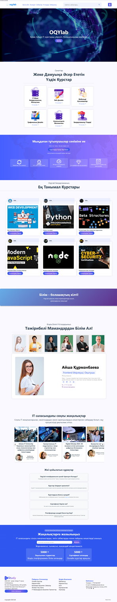
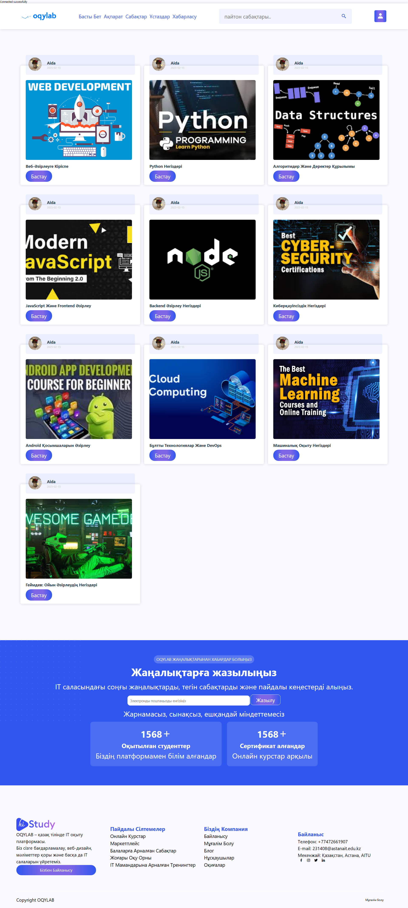
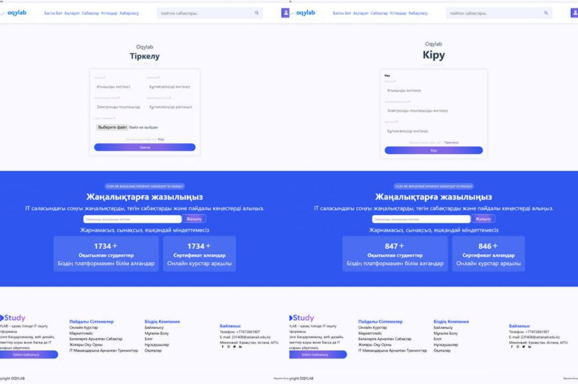
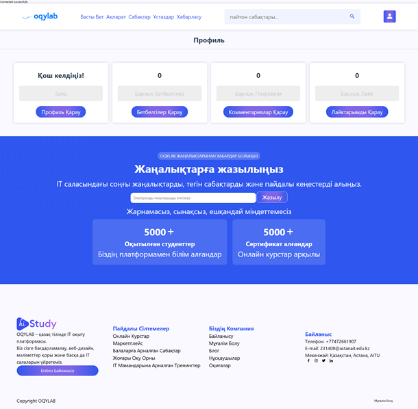
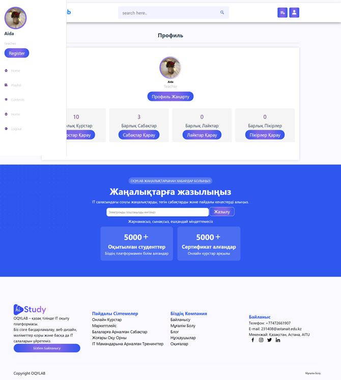

#  OQYlab – Веб-платформа для обучения программированию на казахском языке  

## 📌 О проекте  

**OQYlab** – это образовательная веб-платформа, ориентированная на изучение программирования на **казахском языке**. Проект разработан в рамках научного исследования, основанного на данных анкетирования студентов, выявившего нехватку образовательных ресурсов на казахском языке.  

🔹 **Цель**: Повышение доступности IT-образования для казахскоязычных студентов.  
🔹 **Разработчики**: Команда энтузиастов, стремящихся сделать программирование доступным каждому.  
🔹 **Технологии**: HTML, CSS, JavaScript, PHP, MySQL.  

> 🇰🇿 _«Білімді мыңды жығар»_ – Мы верим, что знания помогут преодолеть любые преграды!  

## 🎯 Основные функции  

✅ **Курсы и уроки** – структурированные материалы по программированию.  
✅ **Полная поддержка казахского языка** – удобный интерфейс и материалы.  
✅ **Взаимодействие пользователей** – возможность ставить лайки и оставлять комментарии.  
✅ **Новости** – актуальная информация о хакатонах, IT-конференциях и событиях.  
✅ **Поиск** – удобная система поиска курсов и уроков.  

🎓 **OQYlab** – это не просто платформа, а целое сообщество, где студенты могут взаимодействовать, делиться знаниями и развиваться вместе!  

## 🖥️ Интерфейс  

### 🏠 Главная страница  

На главной странице находятся:  
- **Категории курсов**  
- **О нас**  
- **Лучшие курсы**  
- **Мотивирующая цитата**  
- **Наши учителя**  
- **Последние новости**  
- **Часто задаваемые вопросы**  
- **Форма подписки на обновления**  

🖼️ _Рис. 1. Фрагмент главной страницы веб-платформы OQYlab_  
  

---

### 📚 Страница курсов  

На этой странице представлены все доступные курсы с возможностью поиска и фильтрации.  

🖼️ _Рис. 2. Каталог курсов на платформе OQYlab_  
  

---

### 🔐 Страницы входа и регистрации  

Интуитивно понятный интерфейс для удобной авторизации пользователей.  

🖼️ _Рис. 6. Страницы входа и регистрации пользователей_  
  

---

### 👤 Профиль пользователя  

В профиле можно:  
- Просматривать **сохраненные курсы (bookmarks)**  
- Следить за **комментариями и лайками**  

🖼️ _Рис. 7. Интерфейс профиля пользователя_  
  

---

### 🛠️ Профиль администратора  

Специальный интерфейс для преподавателей и администраторов:  
- Добавление курсов и плейлистов  
- Управление комментариями  
- Просмотр лайков и курсов  

🖼️ _Рис. 8. Интерфейс профиля администратора_  
  

---

## 🚀 Будущие улучшения  

Мы планируем дальнейшее развитие платформы и внедрение новых возможностей:  

🔹 **Система тестирования** – интерактивные тесты для проверки знаний.  
🔹 **Запуск на сервере** – обеспечение стабильной работы платформы.  
🔹 **Встроенный терминал** – аналог Python Playground для практики кода прямо на платформе.  

💡 **OQYlab – это только начало!** Мы стремимся создать качественную образовательную среду для казахскоязычных студентов.  

## 📩 Контакты  

📧 Если у вас есть вопросы или предложения, напишите мне:  
✉️ **231408@astanait.edu.kz**  

---

✨ _«Білімге құштарлық – болашаққа бастар жол!»_ ✨  
